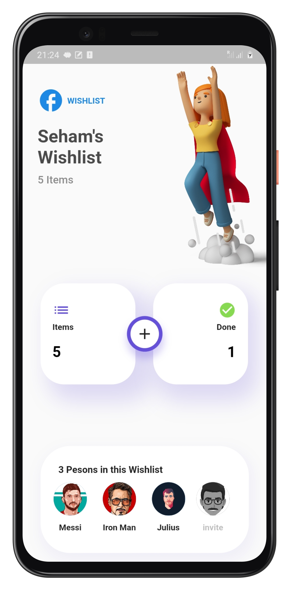
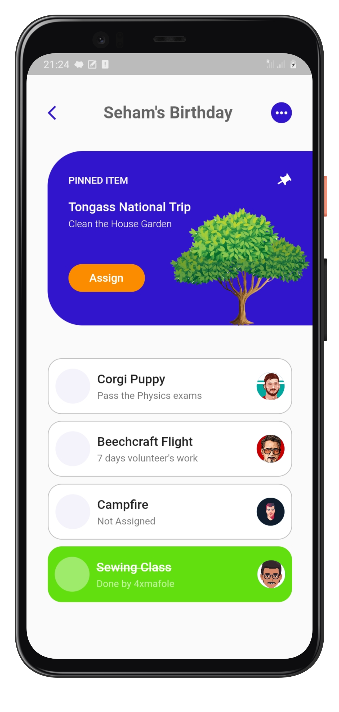

# Wishlist App Design
<<<<<<< HEAD
### <b>Wishlist App</b> 🌠🎇 The idea here to create a space where people can gather their wishes as tasks and assign them to their friends, family members, ...etc. These assignees can accept or reject these ...
=======
### Wishlist App 🌠🎇 The idea here is to create a space where people can gather their wishes as tasks and assign them to their friends, family members, ...etc. These assignees can accept or reject these ...
>>>>>>> 4297395e132f3c35f5c435db67f225320cce5882

 

# Preview
### Source code is available as per designs below.

# Inspiration Design
### I was inspired by this design found on Pinterest: https://nl.pinterest.com/pin/85427724169465822/
 

